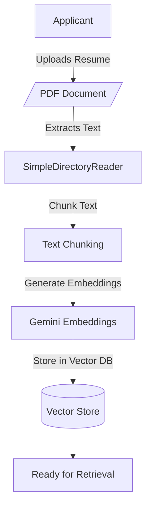
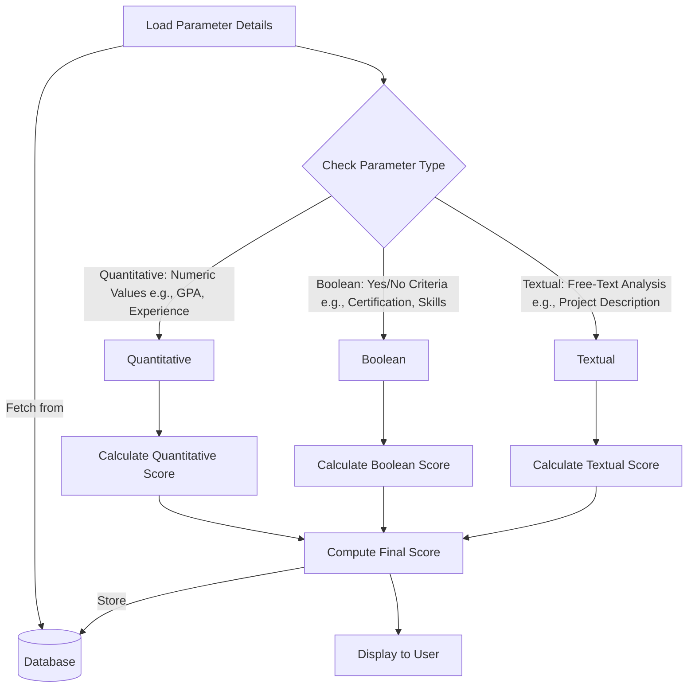
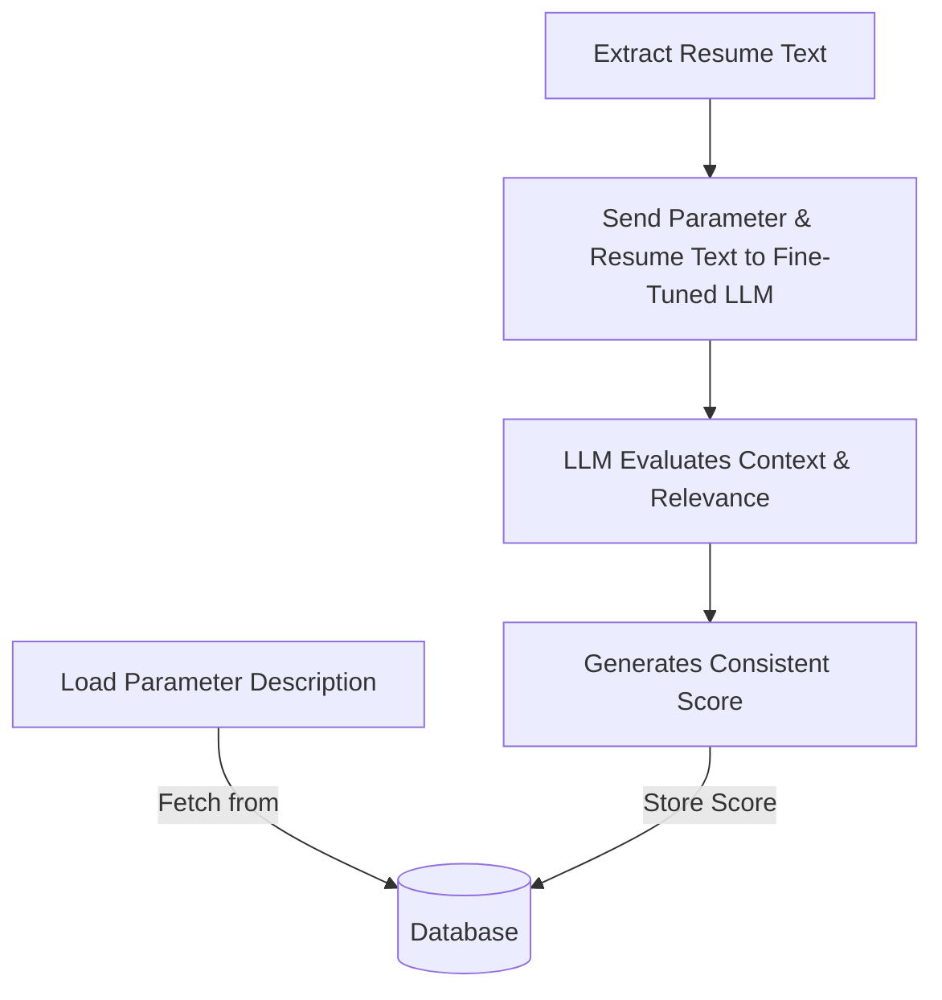
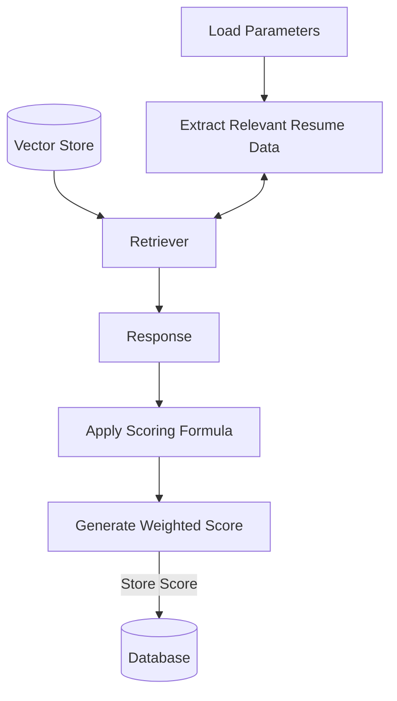
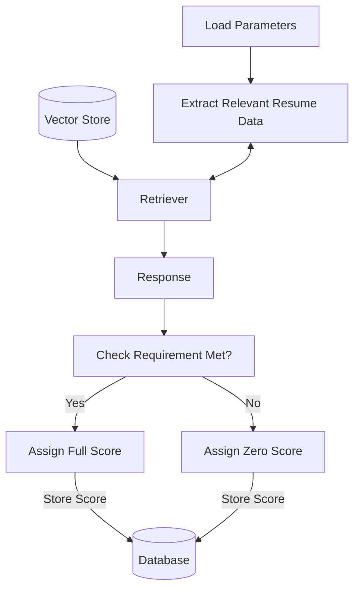

# SmartHire🤖

Welcome to **SmartHire**, An AI-driven resume filtering system that intelligently ranks and shortlists candidates based on job-specific criteria. 

---

## 🌟Quick Introduction

  Hiring the right candidates is challenging, with companies spending significant time reviewing resumes even after automation. Existing methods often rely on rigid filtering, missing strong candidates and failing to provide meaningful shortlisting. Our solution analyzes resumes in context, allowing recruiters to set custom criteria like skills, proficiency , education and even Github activity. With weighted scoring, it scores candidates based on relevance, enabling companies to focus on top applicants and streamline the hiring process efficiently.

### ✨Features
- ✅ **Customizable Evaluation Parameters** - Admins can define their own job-specific criteria for filtering resumes.  
- ✅ **Semantic Evaluation** - Goes beyond basic keyword searches to provide semantic understanding of job descriptions and resumes. 
- ✅ **Dynamic Weight Assignment** - Adjust importance for each parameter to fine-tune ranking.  
- ✅ **AI-Driven Resume Parsing** - Extracts relevant details like skills, experience, and qualifications.  
- ✅ **Eliminates Resume Formatting Issues** - Processes resumes in various formats (PDF, DOCX, etc.) without rejection due to design or structure.  

---

## 🚀 Architecture

### Resume Processing Flow

### Parameter Evaluation Flow

## 🚀 Parameter Classifcation

All provided evaluation criteria (parameters) are classified into three types based on their nature: Quantitative, Boolean, and Textual. This ensures a structured and efficient evaluation process, allowing the system to handle different kinds of job criterias accurately.

### 1️⃣ Textual Parameters

These evaluate proficiency in a given topic by analysing  open-ended descriptions like project details, work responsibilities, and known skills. A fine-tuned LLM analyzes context and assigns scores based on relevance to the job role. These scores assigned are consistent

### 2️⃣ Quantitative Parameters

These parameters involve measurable values like years of experience, GPA, and project counts. The system retrieves relevant details, applies predefined scoring formulas, and assigns a weighted score based on the given range.

### 3️⃣ Boolean Parameters
Boolean parameters are yes/no criteria, such as certifications, specific tool proficiency, or mandatory skills. If the candidate meets the requirement, they receive full points; otherwise, they get none.

---

## ⚙️ Configurations

### Document Processing
- **Chunk Size**: 70 tokens
- **Chunk Overlap**: 10 tokens
- **Document Format**: PDF 

### API Rate Limits
- **Max Requests**: 50 requests per minute
- **Window Size**: 60 seconds
- **Retry Configuration**:
  - Max Attempts: 3
  - Exponential Backoff: 1-10 seconds

### Model Settings
- **LLM**: Google Gemini Pro
- **Fine-tuned Model ID**: `tunedModels/v1smarthirr-64usbdiq2vd5`
- **Temperature**: 0.2
- **Top P**: 0.8
- **Top K**: 40
- **Max Output Tokens**: 2048

### Vector Store
- **Index Type**: VectorStoreIndex
- **Embedding Model**: Gemini Embeddings
- **Storage**: Local Persistence
- **Cache Directory**: `./cache`

---

## 📋 Best Practices & Limitations

### Best Practices

#### Resume Processing
- Keep resumes under 10MB
- Use PDF format for consistent parsing
- Ensure text is extractable (not scanned images)
- Maintain standard formatting
- Clear section headers (Experience, Education, Skills)

#### Parameter Configuration
- Keep parameter names clear and specific
- Assign weights based on job importance
- Use quantitative parameters for measurable criteria
- Use words like Is/Has for boolean parameters
- Use words like Knowledge/Proficienct for textual parameters
  for skill evaluations

### ⚠️ Limitations

- **File Support**: PDF only
- **Maximum File Size**: 10MB
- **Rate Limits**: 50 requests/minute
- **API Timeout**: 30 seconds
- **Vector Dimension**: 768 (Gemini embeddings)
- **Maximum Tokens**: 2048 per request
- **Chunk Limits**: 70 tokens per chunk

---

## 🙌 Credits

This project was developed by **Runtime Terror** as part of **Epitome 25** to enhance AI-driven hiring. Special thanks to:

Sohan, Saahil, and Me – For designing, building, and optimizing the system.
Open-Source Community – For the tools and frameworks that made this possible.
Friends & Supporters – For valuable feedback and insights.
AI Tools – For powering the core of our system.

Built with ☕, ❤️, and endless debugging..
