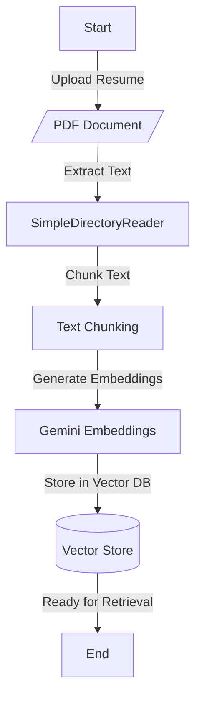

# SmartHire 
An AI-driven resume filtering system that intelligently ranks and shortlists candidates based on job-specific criteria. It allows customizable evaluation parameters, dynamic weight assignments, and integrates language models for precise and efficient screening.

## Features

- ✅ **Customizable Evaluation Parameters** - Admins can define their own job-specific criteria for filtering resumes.  
- ✅ **Semantic Evaluation** - Goes beyond basic keyword searches to provide semantic understanding of job descriptions and resumes. 
- ✅ **Dynamic Weight Assignment** - Adjust importance for each parameter to fine-tune ranking.  
- ✅ **AI-Driven Resume Parsing** - Extracts relevant details like skills, experience, and qualifications.  
- ✅ **Eliminates Resume Formatting Issues** - Processes resumes in various formats (PDF, DOCX, etc.) without rejection due to design or structure.  
---
## Architecture

### Loading Resume
The resume processing pipeline follows these key steps:
1. User uploads the PDF document of Resume
2. Text is extracted using LlamaIndex's SimpleDirectoryReader function
3. Text chunking occurs for optimal processing
4. Gemini embedding generation occurs 
5. Storage in Vector Store for efficient retrieval

---

SmartHire leverages advanced NLP capabilities from LlamaIndex and Gemini to evaluate resumes across multiple parameters:

- **Textual Analysis**: Deep evaluation of candidates' knowledge and skills using fine-tuned LLMs
- **Quantitative Scoring**: Numerical parameter assessment (e.g., years of experience, GPA)
- **Boolean Verification**: Binary checks for specific requirements or certifications
- **GitHub Portfolio Analysis**: Automated assessment of candidates' code repositories
- **Parameter Management**: Dynamic configuration of evaluation criteria through an admin interface

The system is built with modern Python frameworks and employs RAG (Retrieval Augmented Generation) for context-aware evaluations, making it adaptable to various hiring contexts and requirements.

## Tech Stack

- **Backend**: Python, LlamaIndex, Streamlit
- **AI/ML**: Google Gemini, SentenceTransformers
- **Data Storage**: JSON-based persistence
- **Version Control**: Git
- **API Integration**: GitHub API, Google Cloud API

## Key Features

- Custom parameter definition and weight assignment
- Real-time resume processing and scoring
- Detailed evaluation breakdowns with justifications
- GitHub project portfolio analysis
- Interactive web interface for both admins and users
- Configurable scoring mechanisms